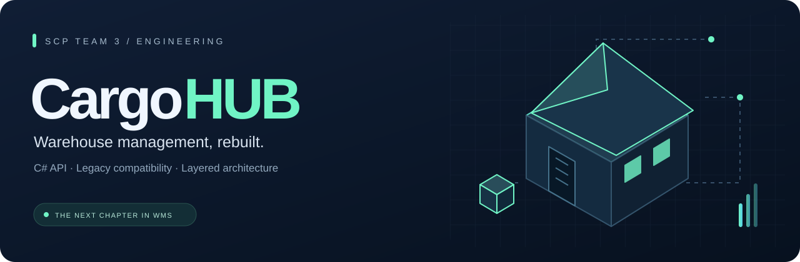

<p align="center">
  
</p>

<p align="center">
  
  
  
  
  
</p>

<p align="center">
  <strong>Van legacy Python naar een onderhoudbare C#-API voor magazijnbeheer.</strong><br />
  Gebouwd door SCP Team 3, met bestaande API-contracten als uitgangspunt.
</p>

<p align="center">
  <a href="#snel-starten">Snel starten</a> ·
  <a href="#architectuur">Architectuur</a> ·
  <a href="#documentatie">Documentatie</a> ·
  <a href="https://dev.finalversion.dev/swagger">Dev API</a>
</p>

---

## Het project

CargoHUB is een warehouse management API. We bouwen de bestaande Python-applicatie stapsgewijs opnieuw in C#, met aandacht voor datavalidatie, testbaarheid en een duidelijke scheiding tussen HTTP-afhandeling, bedrijfslogica en opslag.

De legacy-code en datasets blijven beschikbaar als referentie. Compatibiliteit met bestaande clients is een projectdoel; de migratie is nog in ontwikkeling. Raadpleeg de gegenereerde OpenAPI-specificatie voor de endpoints die de huidige C#-versie aanbiedt.

| API & contracten | Logica & data | Uitvoering & beheer |
| :--- | :--- | :--- |
| Versioned routes onder `/api/v1` | Modellen en validatie in C# | Lokaal met de .NET SDK |
| Swagger UI en Scalar | Entity Framework Core met SQLite | Docker-runtime op Raspberry Pi |
| Legacy-requests als referentie | Databasewijzigingen via migrations | Aparte omgevingen voor `main` en `dev` |

## Snel starten

Benodigd: Git en de **.NET 10 SDK**. Docker is optioneel voor een containerbuild.

```bash
git clone --branch dev https://github.com/bartek-hr/SCP_Team3.git
cd SCP_Team3
dotnet restore CargoHUB.sln
dotnet run --project CargoHUB.csproj --launch-profile http
```

De applicatie draait op **http://localhost:5263**. Bij het starten worden de aanwezige database-migrations toegepast. Standaard staat de SQLite-database in `Datasource/data.sqlite`.

| Lokaal adres | Gebruik |
| :--- | :--- |
| [Swagger UI](http://localhost:5263/swagger) | Endpoints bekijken en requests uitvoeren |
| [Scalar](http://localhost:5263/scalar) | Alternatieve interactieve API-documentatie |
| [OpenAPI JSON](http://localhost:5263/openapi/v1.json) | Machinespecificatie van de huidige API |
| [Readiness](http://localhost:5263/health/ready) | Controleren of de applicatie klaar is |

<details>
<summary><strong>Configuratie van de database</strong></summary>

De standaardconfiguratie staat in `appsettings.json` en `appsettings.Development.json`. Je kunt instellingen ook via omgevingsvariabelen instellen:

| Instelling | Omgevingsvariabele | Betekenis |
| :--- | :--- | :--- |
| `DataDirectory` | `DataDirectory` | Map voor `data.sqlite`; standaard `Datasource/` |
| `ConnectionStrings:DefaultConnection` | `ConnectionStrings__DefaultConnection` | Eigen SQLite-connectionstring; heeft voorrang op het standaard databasepad |

</details>

## Architectuur

Een request loopt via de handlers naar de logica en vervolgens naar de data-accesslaag. Modellen beschrijven de gegevens; Entity Framework Core verzorgt de opslag in SQLite.

```text
HTTP request
    │
    ▼
Handlers  ──▶  Logics  ──▶  Access  ──▶  EF Core / SQLite
 routes        regels      queries       opslag
    └─────────────── Models ───────────────┘
```

| Map | Verantwoordelijkheid |
| :--- | :--- |
| [`Handlers/`](Handlers/) | HTTP-endpoints en responses |
| [`Logics/`](Logics/) | Bedrijfsregels en validatie |
| [`Access/`](Access/) | Databasebewerkingen |
| [`Models/`](Models/) | Domeinmodellen |
| [`Framework/`](Framework/) | Route discovery, requestafhandeling en OpenAPI-integratie |
| [`Datasource/`](Datasource/) & [`Migrations/`](Migrations/) | DbContext en databaseschema |
| [`CargoHUB.Tests/`](CargoHUB.Tests/) | Geautomatiseerde tests |
| [`legacy/`](legacy/) | Oorspronkelijke Python-API en referentiedata |
| [`infra/`](infra/) | Containerdeployment, proxy en lifecyclebeheer |

## Ontwikkelen & testen

```bash
# Bouwen en de test-suite uitvoeren
dotnet test CargoHUB.sln --configuration Release

# Container bouwen; de Dockerfile voert ook de tests uit
docker build -t cargohub:local .
```

Werk op een eigen featurebranch en open een PR naar `dev`. Houd wijzigingen gericht en vermeld in de PR wat is getest. Als je een EF-model wijzigt, controleer dan ook de bijbehorende migration en model snapshot.

De huidige GitHub-testworkflow wordt geactiveerd voor PR’s naar `main` of `master`. Voer voor een PR naar `dev` daarom zelf de tests uit; de deploymentbuild bevat eveneens een teststap.

## Omgevingen

| Omgeving | Branch | API-documentatie |
| :--- | :--- | :--- |
| Main | `main` | [finalversion.dev/swagger](https://finalversion.dev/swagger) |
| Development | `dev` | [dev.finalversion.dev/swagger](https://dev.finalversion.dev/swagger) |
| PR-preview | Handmatig aangevraagde preview | `pr-<nummer>.finalversion.dev/swagger` |

De deploymentworkflow bouwt op een self-hosted Raspberry Pi. Iedere omgeving heeft een eigen SQLite-volume. Een nieuwe container wordt pas doorgeschakeld nadat deze gezond is; previews slapen na 30 minuten zonder requests.

Zie de [deploymenthandleiding](docs/deployment.md) voor installatie, Cloudflare Tunnel en beheercommando’s.

## Documentatie

| Begin hier | Wat je vindt |
| :--- | :--- |
| [Requirements & ontwerpuitgangspunten](docs/notes/requirements.md) | Projectdoelen, compatibiliteit en testaanpak |
| [Legacy API-referentie](docs/legacy-api/README.md) | Endpoints, responsegedrag en authenticatie van de Python-API |
| [Voorbeeldrequests](docs/legacy-api/legacy-api.http) | Uitvoerbare HTTP-requests voor de legacy-API |
| [Request bodies](docs/legacy-api/request-bodies/) | JSON-voorbeelden per endpoint |
| [Legacy-modeldocumentatie](docs/legacy-python/api/models/) | Beschrijvingen van de bestaande modellen |
| [Deployment](docs/deployment.md) | De Raspberry Pi-stack en operationele handelingen |
| [Sprint 0 — taakverdeling](docs/notes/sprint-0/taken-verdeling.md) | Afspraken uit de projectstart |

---

<p align="center">
  <strong>CargoHUB · SCP Team 3</strong><br />
  <sub>Een stevige basis voor de volgende stap in magazijnbeheer.</sub>
</p>
